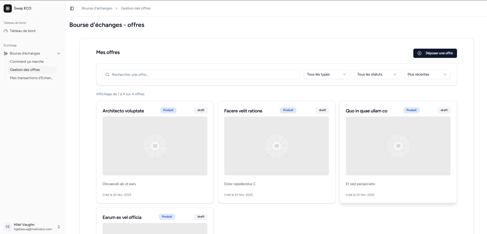

# SwapEco

Une application web moderne construite avec Laravel et React.

## À propos du projet

SwapEco est une bourse de valorisation d’échanges Eco-solidaires inter-entreprises, fondée sur la valorisation des sous-produits et des ressources sous-utilisées.

## Prérequis

-   PHP 8.2 ou supérieur
-   Node.js 18+ et npm
-   Composer
-   SQLite (par défaut) ou autre base de données supportée par Laravel

## Aperçu



## Installation

1. Cloner le dépôt

```bash
git clone https://github.com/samankassou/swapeco.git
cd swapeco
```

2. Installer les dépendances

```bash
composer install
npm install
```

3. Configuration de l'environnement

```bash
cp .env.example .env
php artisan key:generate
```

4. Préparer la base de données

```bash
touch database/database.sqlite
php artisan migrate
```

## Développement

Pour démarrer l'environnement de développement, exécutez :

```bash
composer dev
```

Cela lancera simultanément :

-   Le serveur Laravel (`php artisan serve`)
-   Le worker de queue (`php artisan queue:listen`)
-   Le serveur de développement Vite (`npm run dev`)

## Tests et Qualité de Code

Le projet inclut plusieurs outils pour maintenir la qualité du code :

```bash
# Exécuter tous les tests et vérifications
composer test

# Tests unitaires avec couverture
composer test:unit

# Analyse statique du code
composer test:types

# Vérification du style de code
composer test:lint

# Analyse de la couverture des types
composer test:type-coverage
```

## Stack Technologique

-   **Backend:** Laravel 11, PHP 8.2
-   **Frontend:** React 18, TypeScript, Tailwind CSS
-   **Testing:** Pest PHP
-   **Outils de Qualité:** Laravel Pint, PHPStan, Rector

## Contribution

Veuillez suivre ces étapes :

1. Fork le projet
2. Créez votre branche de fonctionnalité (`git checkout -b feature/AmazingFeature`)
3. Committez vos changements (`git commit -m 'Add some AmazingFeature'`)
4. Push vers la branche (`git push origin feature/AmazingFeature`)
5. Ouvrez une Pull Request

## Flow de travail

Pour éviter les conflits `git`, pensez à:

1. A faire un `git pull`
2. `composer install`
3. `npm install`
4. `php artisan migrate` pour s'assurer que vous avez la dernière version de la BD

## Analyse

1. Diagramme de classes

[Diagramme de classes des offres](docs/diagrams/classes/offers_class_diagram.MD)

2. Cycle de vie d'une offre

[Cycle de vie d'une offre](docs/diagrams/flows/cycle_vie_offre.MD)

## License

Ce projet est sous licence. Voir le fichier `LICENSE` pour plus de détails.
