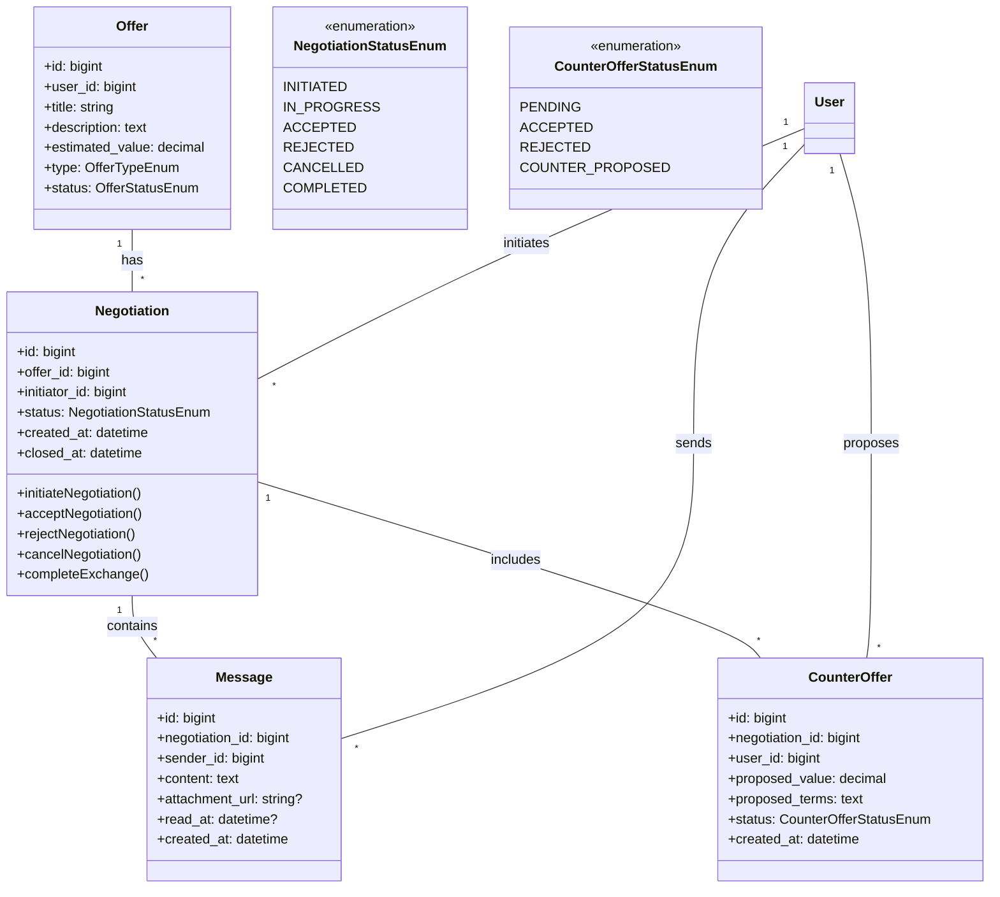

```mermaid
classDiagram
    class Offer {
        +id: bigint
        +user_id: bigint
        +title: string
        +description: text
        +estimated_value: decimal
        +type: OfferTypeEnum
        +status: OfferStatusEnum
    }

    class Negotiation {
        +id: bigint
        +offer_id: bigint
        +initiator_id: bigint
        +status: NegotiationStatusEnum
        +created_at: datetime
        +closed_at: datetime
        +initiateNegotiation()
        +acceptNegotiation()
        +rejectNegotiation()
        +cancelNegotiation()
        +completeExchange()
    }

    class Message {
        +id: bigint
        +negotiation_id: bigint
        +sender_id: bigint
        +content: text
        +attachment_url: string?
        +read_at: datetime?
        +created_at: datetime
    }

    class CounterOffer {
        +id: bigint
        +negotiation_id: bigint
        +user_id: bigint
        +proposed_value: decimal
        +proposed_terms: text
        +status: CounterOfferStatusEnum
        +created_at: datetime
    }

    class NegotiationStatusEnum {
        <<enumeration>>
        INITIATED
        IN_PROGRESS
        ACCEPTED
        REJECTED
        CANCELLED
        COMPLETED
    }

    class CounterOfferStatusEnum {
        <<enumeration>>
        PENDING
        ACCEPTED
        REJECTED
        COUNTER_PROPOSED
    }

    Offer "1" -- "*" Negotiation : has
    Negotiation "1" -- "*" Message : contains
    Negotiation "1" -- "*" CounterOffer : includes
    User "1" -- "*" Negotiation : initiates
    User "1" -- "*" Message : sends
    User "1" -- "*" CounterOffer : proposes
```
