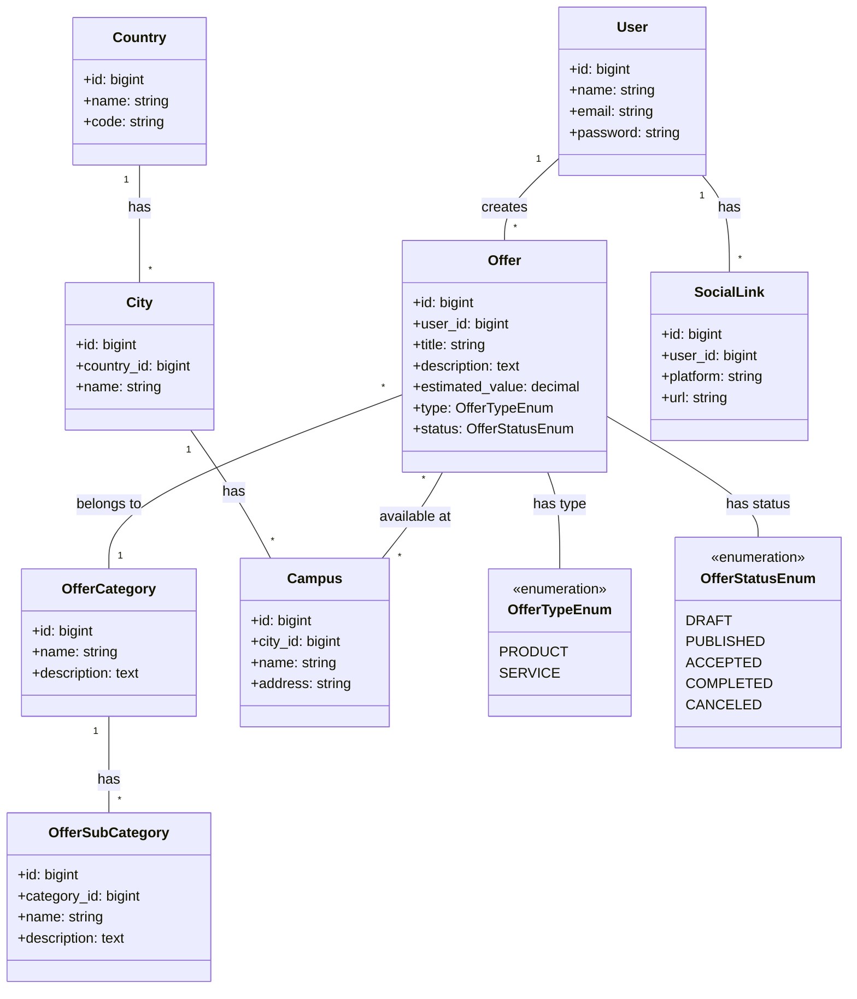

```mermaid
classDiagram
    class User {
        +id: bigint
        +name: string
        +email: string
        +password: string
    }

    class Offer {
        +id: bigint
        +user_id: bigint
        +title: string
        +description: text
        +estimated_value: decimal
        +type: OfferTypeEnum
        +status: OfferStatusEnum
    }

    class OfferCategory {
        +id: bigint
        +name: string
        +description: text
    }

    class OfferSubCategory {
        +id: bigint
        +category_id: bigint
        +name: string
        +description: text
    }

    class Country {
        +id: bigint
        +name: string
        +code: string
    }

    class City {
        +id: bigint
        +country_id: bigint
        +name: string
    }

    class Campus {
        +id: bigint
        +city_id: bigint
        +name: string
        +address: string
    }

    class SocialLink {
        +id: bigint
        +user_id: bigint
        +platform: string
        +url: string
    }

    %% Énumérations
    class OfferTypeEnum {
        <<enumeration>>
        PRODUCT
        SERVICE
    }

    class OfferStatusEnum {
        <<enumeration>>
        DRAFT
        PUBLISHED
        ACCEPTED
        COMPLETED
        CANCELED
    }

    %% Relations
    User "1" -- "*" Offer : creates
    User "1" -- "*" SocialLink : has
    Offer "*" -- "1" OfferCategory : belongs to
    OfferCategory "1" -- "*" OfferSubCategory : has
    Country "1" -- "*" City : has
    City "1" -- "*" Campus : has
    Offer "*" -- "*" Campus : available at

    %% Relations avec les énumérations
    Offer -- OfferTypeEnum : has type
    Offer -- OfferStatusEnum : has status

```
