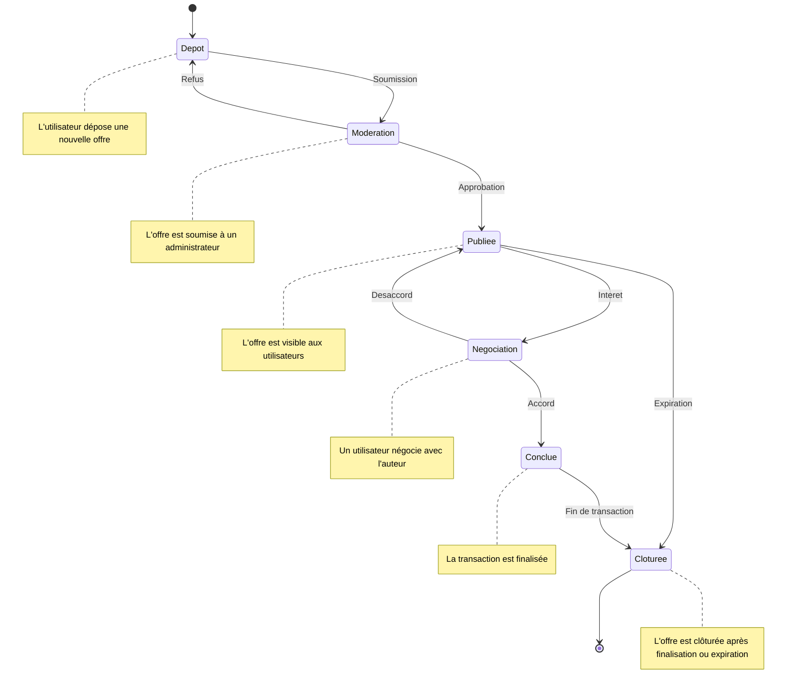

```mermaid
stateDiagram-v2
[*] --> Depot
Depot --> Moderation: Soumission
Moderation --> Publiee: Approbation
Moderation --> Depot: Refus
Publiee --> Negociation: Interet
Negociation --> Conclue: Accord
Negociation --> Publiee: Desaccord
Publiee --> Cloturee: Expiration
Conclue --> Cloturee: Fin de transaction
Cloturee --> [*]

    note right of Depot
        L'utilisateur dépose une nouvelle offre
    end note

    note right of Moderation
        L'offre est soumise à un administrateur
    end note

    note right of Publiee
        L'offre est visible aux utilisateurs
    end note

    note right of Negociation
        Un utilisateur négocie avec l'auteur
    end note

    note right of Conclue
        La transaction est finalisée
    end note

    note right of Cloturee
        L'offre est clôturée après finalisation ou expiration
    end note
```
